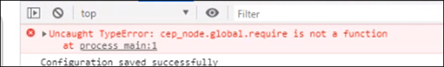

<!-- START doctoc generated TOC please keep comment here to allow auto update -->
<!-- DON'T EDIT THIS SECTION, INSTEAD RE-RUN doctoc TO UPDATE -->
**Table of Contents**  *generated with [DocToc](https://github.com/thlorenz/doctoc)*

- [CEP 10 Known Issues & FAQ](#cep-10-known-issues--faq)
    - [Following are the known issues in CEP 10.0. Please keep these in mind while creating your own extension...](#following-are-the-known-issues-in-cep-100-please-keep-these-in-mind-while-creating-your-own-extension)
  - [Issue 1 :](#issue-1-)
  - [Issues existing in both CEP 9 and CEP 10](#issues-existing-in-both-cep-9-and-cep-10)
  - [FAQ](#faq)

<!-- END doctoc generated TOC please keep comment here to allow auto update -->

CEP 10 Known Issues & FAQ
====================

### Following are the known issues in CEP 10.0. Please keep these in mind while creating your own extension...

## Issue 1 :
  Drag events not fired while debugging an extension. 
    
    Workaround: Deactivate the screencast by selecting the "Toggle device Toolbar" in the chrome inspect window. 
    Once done, Drag operation can be performed even while debugging the extension. 
  

## Issues existing in both CEP 9 and CEP 10  
    
    ### Issue 1: 
    In Windows, the API cep.fs.stat() is not able to access file of size greater than 4GB 

---

## FAQ 

*  **Refer the migration Guidelines for [CEP 9 to CEP 10](./CEP%2010.0%20HTML%20Extension%20Cookbook.md#migration-from-cep-9-to-cep-10)**

*  **If similar error is seen in debug console, confirm\verfiy the following**

    

    * Confirm CEPEngine_extensions.js is NOT integrated in your extension

    * Node could be crashing. Please update node_modules with CEP 10 supported [node version](./CEP%2010.0%20HTML%20Extension%20Cookbook.md#chromium-embedded-framework-cef). 
   

    

