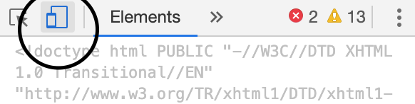

CEP 10 Known Issues 
====================

### Following are the known issues in CEP 10.0. Please keep these in mind while creating your own extension...

## Issue 1 :
  Drag events not fired while debugging an extensions. 
    
    Workaround: Deactivate the screencast by selecting the "Toggle device Toolbar" in the chrome inspect window. Once done, Drag operation can be performed even while debugging the extension. 
  

## Issues existing in both CEP 9 and CEP 10  
    
    ### Issue 1: 
    cep.fs.stat() - Not able to access file of size greater than 4GB 

    ### Issue 2:
    Few extensions are displayed truncated on Windows 10