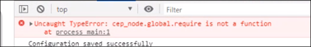

CEP 11 Known Issues & FAQ
====================

### Following are the known issues in CEP. Please keep these in mind while creating your own extension...

## Issue 1 (CEP 11) : evalScript callback is not triggered in cross-site iFrames

From CEP-11 one can't access a `<iframe>` with a different origin (Cross-Site) using JavaScript. For the same-origin policy browsers block scripts trying to access a frame with a different origin.

Origin is considered Cross-Site if at least one of the following parts of the address isn't maintained:
`protocol://hostname:port/...`
Protocol, hostname, and port must be the same as your domain if you want to access a frame.

**Workaround**
Even though same-origin policy blocks scripts from accessing the content of sites with a different origin, if you own both the pages, you can work around this problem using window.postMessage and its relative message event to send messages between the two pages, like this:

In your Cross-Site `<iframe>` (contained in the main page):

`mainFrameWindow.postMessage(/*any variable or object or evalscript*/, 'http://your-main-site.com');`

The second argument to postMessage() can be '*' to indicate no preference about the origin of the destination. A target origin should always be provided when possible, to avoid disclosing the data you send to any other site.

In your main page:

```
window.addEventListener('message', event => {
    // IMPORTANT: check the origin of the data! 
    if (event.origin.startsWith('http://your-cross-site-iframe.com')) { 
        // The data was sent from your site.
        // Data sent with postMessage is stored in event.data:
        console.log(event.data); 
        // We can also invoke evalScript sent from Cross-site frame [CEP]
        var script=event.data;
        CSInterface.evalScript(script);
    } 
    else {
        // The data was NOT sent from your site! 
        // Be careful! Do not use it. This else branch is
        // here just for clarity, you usually shouldn't need it.
        return; 
    } 
}); 
```

This method can be applied in both directions, creating a listener in the cross-site child frame too, and receiving responses from the Mainframe. The same logic can also be implemented for running CEP EvalScript from cross-site child frames- Pass your EvalScript as an event from Cross-Site child frame to Main Page and invoke EvalScript from Main Page/Frame
  
## Issue 2 (CEP 11): UI issues with cross-site iFrames 
CEF latest versions has introduced [Site Isolation](https://www.chromium.org/Home/chromium-security/site-isolation) and due to this the **cross site iframes** are handled by their own CEF renderer process. 

Some inter-process communication calls from this new renderer process are not being propagated to the browser process, causing the UI glitches (like tabbing, hover, shortcuts, etc) and the clipboard issues. The use of `dispatchEvent` is also affected.

**Workaround**: Extensions that are facing these issues can add the `--disable-site-isolation-trials` command line parameter in the manifest. This will disable the Site Isolation features. As a side effect, some checks corresponding to **cross origin iframes** may not be enforced, allowing you to access the cross origin iframe from the parent frame. 
```
<CEFCommandLine>
+ <Parameter>--disable-site-isolation-trials</Parameter>
  <Parameter>--enable-nodejs</Parameter>
  <Parameter>--mixed-context</Parameter>
</CEFCommandLine>

```

**Note**: This should not be taken as a permanent fix as with further CEF updates, this parameter might be disabled


## Issues existing in CEP 9 and above  

### Issue 3 : Drag events not fired while debugging an extension. 
    
    Workaround: Deactivate the screencast by selecting the "Toggle device Toolbar" in the chrome inspect window. 
    Once done, Drag operation can be performed even while debugging the extension. 
  
    
### Issue 4: 
In Windows, the API cep.fs.stat() is not able to access file of size greater than 4GB 

### Issue 5: CEP capped to 30fps
On Mac, CEF has frame rate clamped at 30 fps. CEP doesn't interfere with these configuration for performance concerns.
Although a possible workaround to remove this cap is to add --disable-frame-rate-limit as CEFCommandLineArgs in manifest.xml, we don't recommend this as
it turn vsync off, which virtually creates uncontrolled number of frames. This can max out CPU & GPU usage which may cause hanged & stuttering display. 


---

## FAQ 

*  **Refer the migration Guidelines for [CEP 10 to CEP 11](./CEP%2011.1%20HTML%20Extension%20Cookbook.md#migration-from-cep-10-to-cep-11)**

*  **If similar error is seen in debug console, confirm\verfiy the following**

    

    * Confirm CEPEngine_extensions.js is NOT integrated in your extension

    * Node could be crashing. Please update node_modules with CEP 11 supported [node version](./CEP%2011.1%20HTML%20Extension%20Cookbook.md#chromium-embedded-framework-cef). 
