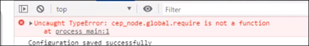

<!-- START doctoc generated TOC please keep comment here to allow auto update -->
<!-- DON'T EDIT THIS SECTION, INSTEAD RE-RUN doctoc TO UPDATE -->
**Table of Contents**  *generated with [DocToc](https://github.com/thlorenz/doctoc)*

- [CEP 12 Known Issues & FAQ](#cep-12-known-issues--faq)
    - [Following are the known issues in CEP. Please keep these in mind while creating your own extensions](#following-are-the-known-issues-in-cep-please-keep-these-in-mind-while-creating-your-own-extensions)
  - [Issue 1 (CEP 12) : CSInterface's version specific APIs show incorrect Operating System Version](#issue-1-cep-12--csinterfaces-version-specific-apis-show-incorrect-operating-system-version)
    - [Note:](#note)
  - [Issue 2 (CEP 12): SharedArrayBuffer changes can't be accessed if Cross-Origin isolation is disabled](#issue-2-cep-12-sharedarraybuffer-changes-cant-be-accessed-if-cross-origin-isolation-is-disabled)
  - [FAQ](#faq)

<!-- END doctoc generated TOC please keep comment here to allow auto update -->

CEP 12 Known Issues & FAQ
====================

### Following are the known issues in CEP. Please keep these in mind while creating your own extensions 

## Issue 1 (CEP 12) : CSInterface's version specific APIs show incorrect Operating System Version
CSInterfaces API are unable to detect OS version correctly (Win 11, Mac OS 12(only arm) and Mac OS 13 (both intel and arm)) because of underlying CEF limitations. CEP 12 will not be able to list the correct OS version details those platforms.

### Note:
This does not impact Win 10 and Mac OS's less than v11

  
## Issue 2 (CEP 12): SharedArrayBuffer changes can't be accessed if Cross-Origin isolation is disabled
Extensions can go blank if it uses SharedArrayBuffer with Cross-Origin isolation disabled. This issue was introduced in CEF 91 and it is carried into CEF 99 as well.
For more details refer [here](https://github.com/browserify/node-util/issues/58)

---

## FAQ 

*  **Refer the migration Guidelines for [CEP 11 to CEP 12](./CEP%2012%20HTML%20Extension%20Cookbook.md#migration-from-cep-11-to-cep-12)**

*  **If similar error is seen in debug console, confirm\verfiy the following**

    

    * Confirm CEPEngine_extensions.js is NOT integrated in your extension
    * Node could be crashing. Please update node_modules with CEP 12 supported [node version](./CEP%2012%20HTML%20Extension%20Cookbook.md#chromium-embedded-framework-cef).

* **Known issues from CEP 11 are still applicable to CEP 12 as well. Refer [here](../../CEP_11.x/Documentation/Issues.md)**

