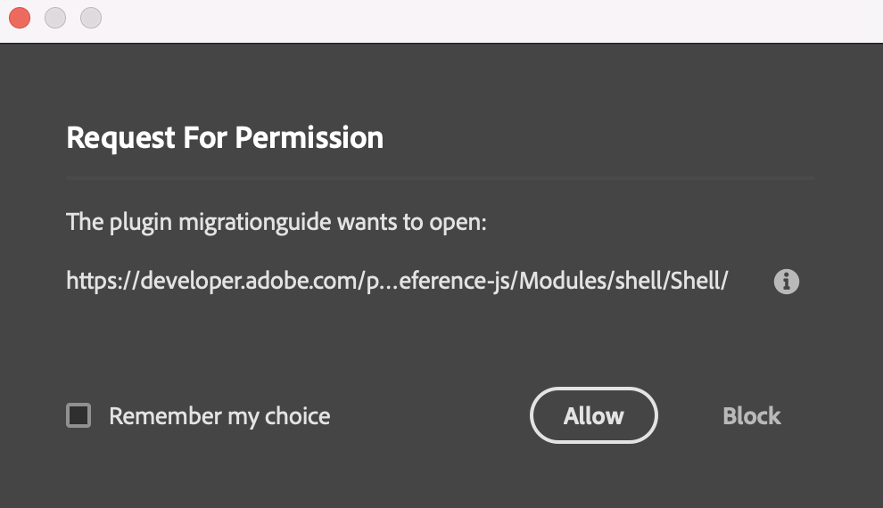

# CEP to UXP Technical Migration Guide
This guide is geared towards CEP (Common Extensibility Platform) developers who would like more technical guidance on migrating their extensions to UXP (Unified eXtensibility Platform). The migration process is no doubt challenging but will dramatically improve your development experience for future iterations of your plugins. 

- [CEP to UXP Technical Migration Guide](#cep-to-uxp-technical-migration-guide)
  - [Why migrate to UXP?](#why-migrate-to-uxp)
    - [Developer Tooling](#developer-tooling)
    - [Plugin Types](#plugin-types)
  - [UXP Plugin Development](#uxp-plugin-development)
    - [Entrypoint Setup](#entrypoint-setup)
    - [User Interface](#user-interface)
  - [Migrating Native CEP Functions](#migrating-native-cep-functions)
    - [Directory and File I/O Operations (File APIs)](#directory-and-file-io-operations-file-apis)
    - [Encoding API](#encoding-api)
    - [Opening Remote Resources](#opening-remote-resources)
    - [Process APIs](#process-apis)
  - [Migrating CEP JavaScript Libraries](#migrating-cep-javascript-libraries)
    - [Vulcan Interface: Communicating across plugins within Photoshop](#vulcan-interface-communicating-across-plugins-within-photoshop)
    - [CS APIs: Communicating with your plugin and with Photoshop](#cs-apis-communicating-with-your-plugin-and-with-photoshop)
      - [Use Case: API Version](#use-case-api-version)
      - [Use Case: Sending/Receiving Events](#use-case-sendingreceiving-events)
      - [Use Case: Network Access](#use-case-network-access)
      - [Use Case: Customizing Menus](#use-case-customizing-menus)
      - [Use Case: Theme Support](#use-case-theme-support)
      - [Use Case: Localization](#use-case-localization)
      - [Use Case: Keyboard Events](#use-case-keyboard-events)
      - [Use Case: Adjusting Plugin Size](#use-case-adjusting-plugin-size)
  - [Migrating ExtendScript/EvalScript to the Photoshop DOM API](#migrating-extendscriptevalscript-to-the-photoshop-dom-api)

CEP is natively supported on M1 devices for all applications except for Photoshop.  You can continue to run CEP extensions natively on Windows and on M1 machines by running Photoshop in Rosetta mode. The missing M1 support for native Photoshop usage on M1 machines is a strong reason to start thinking about migrating existing CEP extensions to UXP plugins.  

There is no clear-cut path for migration, given that CEP and UXP are fundamentally different. CEP was based on CEF ([Chromium Embedded Framework](https://bitbucket.org/chromiumembedded/cef)), making it effectively act as a browser. UXP, on the other hand, is not a browser, and therefore complete feature parity is unlikely. This migration should serve as an opportunity to design a better, more performant version of your existing CEP extension, and perhaps a chance to add new features and support modern workflows. In fact, it is better to think of this process as a “reconstruction” with the benefits of UXP in mind, rather than a migration. 

For many of your end-users who love the existing CEP version of your plugin, there may be no need to switch for several years. It is the group of users running Photoshop natively on M1 Mac machines that require a UXP version of your plugin and delivering a UXP plugin could attract new users! 

## Why migrate to UXP? 

UXP provides a comprehensive extensibility solution, turning JavaScript and HTML markup into controls in native application windows. You can think of UXP as a small runtime with a subset of browser functionality that we intend to grow. It has a DOM, with auto-layout and CSS Flexbox layout capabilities. UXP can run JS using the platform-specific JS engine, laying out native controls on screen, and enabling C++ and JS hybrid app development. A unified, modern execution environment (JavaScript V8) allows plugin UI and business logic to share the same context, which means no need to use `evalScript` anymore!

### Developer Tooling

Here is the [CEP debugging guide](https://github.com/Adobe-CEP/CEP-Resources/blob/master/CEP_11.x/Documentation/Debugging%20Handbook.md). Here is the [UXP debugging guide](https://developer.adobe.com/photoshop/uxp/2022/guides/debugging/). The [UXP Developer Tool](https://developer.adobe.com/photoshop/uxp/2022/guides/devtool/) is a plugin loader and debugger that makes plugin management during development easier. 

### Plugin Types 

In the CEP world, if you want the extension to appear in the Window-->Extensions menu, add the `<Menu>` tag. If you want the extension to launch on an event, specify those events using the `<StartOn>` tag. All CEP extension types must be specified in the manifest.xml file.  

|CEP Extension Type |Specifications| 
|:------ | :------ |
| Panel | <ul><li>Dockable</li><li>Resizable</li><li>Fly-out menus</li><li>Re-opened at startup if open at shutdown</li></ul>
| Modal Dialog | Opens a new extension window and forces the user to interact with it before returning control to the host application
| Invisible/Custom | Extensions that never become visible during their lifecycle (CEP 5.0+)
| Modeless | Opens a new extension window but does not force the user to interact with the extension window

Meanwhile, UXP plugins are either commands or panels. Plugin metadata like the size, icons, label, and ID are defined in the `manifest.json` file. Plugin functionality and behavior is defined using the `entrypoints.setup()` API.   

|UXP Plugin Type |Specifications| 
|:------ | :------ |
| Panel | <ul><li>Dockable</li><li>Resizable</li><li>Fly-out menus</li><li>Fly-out menus</li><li>Easily theme-aware</li><li>By default, loads only when needed (PS 23.1+)</li><li>Can be launched in a modal state</li></ul>
| Command | <ul><li>Direct action command that executes a custom task</li><li>Triggered by user selection from Plugins menu</li><li>Option for no UI</li><li>A progress bar dialog will appear with a “Cancel” option if the task runs for longer than 2 seconds. To identify which task is running, the progress bar will be labeled with your command name.</li><li>Can be launched in a modal state</li></ul>

[Appendix 1: An overview of UXP vs. CEP vs. ExtendScript](appendix_1.md)

## UXP Plugin Development
### Entrypoint Setup
Using `entrypoints.setup()` API, handlers and menu items for the entry points are defined in manifest. The `entrypoints` object consists of 3 objects: 
1. plugin: This can be an object or a function. If this is a function, it is assumed as the `create` handler (described below). 
   * `create()`: This is called after plugin is loaded. 
   * `destroy()`: This is called before plugin is unloaded. 
2. panels: This contains a list of key-value pairs where each key is a panel id (string) and value is the data for the panel whose type can be object/function. If the value is a function, it is assumed to be the `show` method (described below). If an object, it can contain any of the following properties but must define either `create` or `show`. Each of the following functions return a promise if successful and should throw an exception or return a rejected promise to signal failure.  
   * `create()`: This is called when a panel is created. 
   * `show()`: This is called when a panel is shown. 
   * `hide()`: This is called when a panel is hidden. 
   * `destroy()`: This is called when a panel is going to be destroyed. 
   * `invokeMenu()`: This is called when a panel menu item is invoked. Menu id is passed as the first argument to this function.  
   * `menuItems`: This is an array of menu items. Each item can be a string or an object with the properties defined below, in the same order as specified in this array.  For specifying a separator, a value of "-" or menu item with label "-" can be used at required place in the array. 
     * {string} id - identifier of the menu item.  
     * {string} label - display text for the menu item. Should be localized. If label is not specified, id is used as label. 
     * {boolean} enabled - enabled/disabled state for the menu item. Default - true. 
     * {boolean} checked - checked state for the menu item. Default - false. 
     * {Array} submenu - submenu for this menu item again as an array of `menuItems`. `id` of submenus should still be unique across panel. 
3. commands: This object contains a list of key-value pairs where each key is the command ID and each value is the command's data whose type can be an object or function. If the command’s data is a function, it is assumed to be the `run()` method.
   * `run()`: This is called when the command is invoked via menu entry. 
   * `cancel()`: This is called when the command is cancelled/aborted before completion. 

### User Interface
UXP plugins can use platform-native HTML and CSS components such as buttons, input fields, etc. But a plugin can also use [Spectrum UXP](https://developer.adobe.com/xd/uxp/uxp/reference-spectrum/) components.

## Migrating Native CEP Functions
There is a common set of APIs that plugins need access to, regardless of the host app. These include file I/O and network, among others. This section will discuss the native CEP APIs extensions are able to rely on, and guidelines for migrating those APIs to UXP.  

### Directory and File I/O Operations (File APIs) 
In CEP extensions, developers use the `window.cep.fs` object to perform directory and file I/O operations. CEP developers have arbitrary access to disk and machine resources, and arbitrary ability to launch processes (including bash scripts). Users do not have to consent to extensions accessing their file system. Because developers have full access, all file access is technically persistent. Secure storage, on the other hand, does not exist for CEP. 

UXP’s `storage` module can read and write files and folders in the user's file system, but with different API signatures. Because of sandboxing requirements of recent OS releases, UXP does not allow arbitrary access to any file on the host system. Therefore, these files are accessed by making a request to the user (by showing a file-picker dialog) and obtaining a token. File accesses outside of the plugin's root folder, the plugin's data folder, and a plugin temporary folder require the user's permission. Persistent file storage and secure storage are available in UXP as well. Refer to these notes: [file access](https://developer.adobe.com/photoshop/uxp/2022/guides/uxp_guide/uxp-misc/file-access/), [persistent file storage](https://developer.adobe.com/photoshop/uxp/2022/uxp/reference-js/Modules/uxp/Persistent%20File%20Storage/), and UXP-specific [(secure) storage](https://developer.adobe.com/photoshop/uxp/2022/uxp/reference-js/Modules/uxp/Key-Value%20Storage/SecureStorage/). If you need constant access to a location to write and read files, for now, use the UXP sanctioned location for your plugin data or [persistent file access tokens](https://developer.adobe.com/photoshop/uxp/2022/uxp/reference-js/Modules/uxp/Persistent%20File%20Storage/FileSystemProvider/#createpersistenttokenentry).

### Encoding API
CEP extensions can access the encoding API with the `window.cep.encoding` object. With this API, they can implement encoding while reading and writing file content. In UXP, you can directly provide the required encoding as a string literal argument when invoking methods to read/write file content. CEP developers can use UTF8 or Base64 encoding. UXP on the other hand, supports the following text encodings: utf-8, utf-16be, and utf-16le. 

### Opening Remote Resources 
The `window.cep.util` object gives CEP developers access to `openURLInDefaultBrowser`, `registerExtensionUnloadCallback`, and `storeProxyCredentials`. In UXP, the “shell” module contains an equivalent for `openURLInDefaultBrowser` (opens web link in system browser): `openExternal`. The UXP shell module does not (and will not) have equivalent methods for `registerExtensionUnloadCallback` and `storeProxyCredentials` in CEP. 

In UXP, you can use `openPath` and `openExternal` to open external files and remote resources.  With UXP 6.0.2+, [manifest v5](https://developer.adobe.com/photoshop/uxp/2022/guides/uxp_guide/uxp-misc/manifest-v5/#launch-process) asks that you define which URI schemes and file extensions your plugin is permitted to launch.   

### Process APIs
CEP developers can use the `window.cep.process` object to create (and maintain) processes. Here is the code to create a process and check if it is running: 

``` 
var result = window.cep.process.createProcess("usr/X11/bin/xterm"); 

if(result.err === 0){ 
  var pid = result.data; 
  result = window.cep.process.isRunning(pid); 
  if(result.data === true){ 
    // running                   
  } 
} 
``` 

UXP does not yet have its own comprehensive set of process APIs. In UXP, you can use `openPath` and `openExternal` to open external files and remote resources.  With UXP 6.0.2+, manifest v5 asks that you define which URI schemes and file extensions your plugin is permitted to launch.    

``` 
"requiredPermissions": {         
    "launchProcess": {     
        // allows launching files with specified URI schemes          
        "schemes":  
            [ "https", "slack", "adobe" ],    
        // allows opening files with the specified file extensions           
        "extensions":  
            [ ".pdf", ".xd", ".psd" ],         
    },    
} 
``` 

Both `openPath` and `openExternal` rely on this permission set, and upon either function call, the user will get a runtime consent dialog (shown below). Only after they agree will the API call be executed.  



## Migrating CEP JavaScript Libraries
CEP JavaScript Libraries are counterparts of the Flex CSXS Library. They provide JavaScript APIs to access host application and CEP information. UXP allows each host application to expose APIs directly to the developer. This document will look specifically at what the Photoshop UXP API can provide to help you migrate.  

### Vulcan Interface: Communicating across plugins within Photoshop 
Vulcan is an (older) Adobe library that serves as an inter-plugin communication mechanism across Adobe host applications. These APIs are not accessible from within UXP, but inter-plugin communication APIs have been added in UXP 6.0.2.  

In UXP 6.0.2 (manifest v5), you can specify the appropriate flags in the manifest and use `invokeCommand` to execute both commands and `showPanel` to expose panels from other plugins.  
| Type | CEP | UXP 
| :--- | :--- | :---
| Plugin communication across host applications | Yes | Not yet 
| Plugin communication within the same host application | Yes | Yes, UXP 6.0.2+

### CS APIs: Communicating with your plugin and with Photoshop
`CSInterface` is used to access information about the host application in which an extension is running, launch an extension, register interest in event notifications, and dispatch events. `CSInterface` helps with theming in Photoshop as well as customizing menus (fly-out and context menu).  

#### Use Case: API Version
In CEP, you need to check the version tag of the CEP JavaScript APIs against the version of CEP integrated by Photoshop to make sure the API you want to use is available. `CSInterface.getCurrentAPIVersion()` is a method that retrieves the version of CEP integrated by Photoshop.  

In UXP, the Photoshop version that a plugin is targeting needs to be specified in the manifest configuration. Additionally, you can specify the Photoshop API version the plugin should target.

**Specify Photoshop and Photoshop API Version in the manifest.**

The v1 implementation (Photoshop 2021) does not allow plugins to run in isolation, thereby allowing any plugin to modify the Photoshop state at any time. Photoshop 2022 introduced a modal JS scope, allowing plugins to run in isolation and guaranteeing against plugins modifying Photoshop at the same time.	 

What changes were made for v2?  
* Suspend/resume history states. See [executeAsModal](https://developer.adobe.com/photoshop/uxp/2022/ps_reference/media/executeasmodal/) for details. 
* Updated Photoshop DOM access. See [changelog](https://developer.adobe.com/photoshop/uxp/2022/ps_reference/changelog/#updated-dom-api) here. 

Photoshop 2021 supports only v1, while Photoshop 2022 supports both v1 and v2 of the API. Developers can specify which version to target in the manifest.  The manifest has a `host` value that takes a `data` object with an `apiLevel` field. This `apiLevel` field is optional and by default:  
* A plugin on a PS version of less 23.0.0 will target Photoshop API v1 
* A plugin on a PS version of 23.0.0 or greater will target Photoshop API v2 

While plugins can still use v1, many new features are only available on Photoshop API v2 and support for v1 will be removed in a future major update to Photoshop. Only special use cases that rely on either the Photoshop menu state, or other non-modal user interactions while the plugin is running may need to stick with v1.  

**Access host application version**: `require(“uxp”).host.version` 

**Access UXP API version**: `require(“uxp”).versions.uxp` 

**Access plugin version from manifest**: `require(“uxp”).versions.plugin`

#### Use Case: Sending/Receiving Events

CSXS/CEP events are used to send events among extensions in an application, and among extensions in different applications.  

**Photoshop DOM events**: You can send and receive events within an extension by attaching event listeners in the DOM of the plugin panel or modal, and then listening for changes in the Photoshop app by using the Photoshop UXP API. 

**UXP events**: UXP has lifecycle events that allow you to receive and send events to the host application and better manage your plugin’s lifecycle.  

The following are plugin lifecycle events you plugin can listen for:   
* `uxpcreateplugin`: Indicates that the plugin’s JS context has been created and that the plugin has been loaded successfully.  
* `uxpdestroyplugin`: Indicates that the plugin’s JS context is about to be destroyed. 

The following are panel lifecycle events your plugin can listen for:  
* `uxpcreatepanel`: Indicates that a panel is about to be created. This is called when a panel is first displayed, and each time after it is destroyed. 
* `uxpdestroypanel`: Indicates that a panel is about to be destroyed. 
* `uxpshowpanel`: Indicates that a panel is about to be shown and should render its UI into the attached node. This is called every time a panel is shown. 
* `uxphidepanel`: Indicates that a panel is hidden.  
* `uxpinvokepanelmenu`: Indicates that a panel menu item has been invoked.  

The following are command lifecycle events your plugin can listen for: 
* `uxpcommand`: Indicates that the user (or Photoshop) has requested the plugin execute a command.  
* `uxpcommandrun`: Indicates that the plugin will execute a command. 
* `uxpcommandcancel`: Indicates that the user has cancelled the command.  

To support these events, we’ve added: 

1. Async support on entrypoints 
2. Entrypoints parameter changes with the latest manifest update:  
   * [v4](entrypointsetup-v4.js) - takes Event {event name, node, PanelID, PanelInfo}
   * [v5](entrypointsetup-v5.js) - takes node and data(if applicable) 
3. Entrypoints now have a default timeout of 300 milliseconds 

#### Use Case: Network Access
CEP used to leverage CSInterface.js to get network information. Network access in UXP requires you define the domains the plugin will access in the manifest. You can do this by adding the network object to the `requiredPermissions` section of the manifest. 

UXP supports XMLHttpRequest, WebSockets, and Fetch APIs to perform network requests. 

Limitations:  
* On macOS, it is not possible to use self-signed certificates with secure WebSockets.  
* WebSockets do not support extensions. 
* XHR can only send binary content using an ArrayBuffer -- Blob is not supported. 
* XHR does not support cookies. 
* responseURL is not supported on XHR 

#### Use Case: Customizing Menus
CSInterface has two APIs that can be used for customizing flyout menus. Refer to [these notes](https://github.com/Adobe-CEP/CEP-Resources/blob/master/CEP_11.x/Documentation/CEP%2011.1%20HTML%20Extension%20Cookbook.md#fly-out-menu) for an example of how to configure content for flyouts, and how to use them in tandem with event listeners. 

In UXP, flyout menus are defined by a JSON structure that is passed to the `entrypoints.setup` method. This method tells UXP how to handle the entrypoints defined in the manifest.json file. When a menu item is invoked by the user, UXP will pass the flyout menu ID back. Developers can use this ID to customize code to handle each menu item they define. Define the label for the menu item in the Plugins panel that users will select to run your plugin in the manifest.json (EntryPointDefinition.label). Here is an [example](https://developer.adobe.com/photoshop/uxp/2022/guides/uxp_guide/uxp-misc/flyout-menus/#flyout-menus) detailing this flow. 

#### Use Case: Theme Support
CSInterface uses the theme manager interface and CSInterface to update the extension theme after the host application’s theme changes. CSInterface does this by listening for CSXS event “com.adobe.csxs.events.ThemeColorChanged”. CEP would access the latest host theme information using `var skinInfo = JSON.parse(window.__adobe_cep__.getHostEnvironment()).appSkinInfo;`. This `skinInfo` object holds the host theme info and font info and can be modified. In UXP, you can add theme awareness to your application using Spectrum CSS and media queries. 

#### Use Case: Localization 
CEP uses host environment information provided in the manifest to load and update the extension. This guide details [CEP support](https://github.com/Adobe-CEP/CEP-Resources/blob/master/CEP_9.x/Documentation/CEP%209.0%20HTML%20Extension%20Cookbook.md#localization) for localization. In UXP, you can localize [retrieve locale info](https://developer.adobe.com/photoshop/uxp/2022/guides/uxp_guide/uxp-misc/localization-and-platforms/) for the host environment and use the returned string to alter your plugin’s behavior. As a developer, you can also localize [plugin menu item labels and panel labels](https://developer.adobe.com/photoshop/uxp/2022/guides/uxp_guide/uxp-misc/localization-and-platforms/) in your manifest configuration.   

#### Use Case: Keyboard Events 

CEP allows you to register an interest in specific keyboard events to prevent them from being sent directly to the host application, allowing you to implement your own callback functions. UXP does not support registering keyboard events in the same manner. Your UXP plugin can set focus on a control inside a panel and listen for several types of keyboard presses, but there’s no way to do this globally to override the global shortcuts. (To request this feature, please mention it [in our UXP developer forums](https://forums.creativeclouddeveloper.com/t/how-to-set-a-keyboard-shortcut-for-a-photoshop-uxp-plugin/3236).)

#### Use Case: Adjusting Plugin Size 

For modal and modeless CEP extensions, using `window.__adobe_cep__.resizeContent()` takes two parameters (width and height) and resizes the extension’s content to the specified dimensions. The width and height parameters are expected to be unsigned integers. Please note that extension min/max size constraints as specified in the manifest file apply and take precedence. If the specified size is out of the min/max size range, the min or max bounds will be used. 

UXP plugins are restricted to the sizes defined by the manifest. Plugins also cannot control the size of their panel programmatically. The expectation is that plugin developers will design their UI in a responsive manner – allowing the user to configure the panel to their liking. If your plugin consists of multiple accordions in the UI, you might want to consider shipping with multiple panels instead. Then the user can group all those panels together, resize them, reorder them, collapse them, etc., as defined in the manifest. 

## Migrating ExtendScript/EvalScript to the Photoshop DOM API
JSX files define functions and objects to be executed in Photoshop’s ExtendScript environment. These are executed in CEP either at plugin load time or using `evalScript`. You specify the path to JSX files in <ScriptPath> node in manifest.xml.  

All ExtendScript calls to Photoshop were synchronous and blocked the host application UI while executing. In UXP, method calls are asynchronous and do not block the UI thread. To assist a smoother transition between the ExtendScript DOM and the UXP API, UXP functions are asynchronous by design but can be used for synchronous execution and do not need to be awaited.  

In UXP, you cannot load and execute JSX files directly. Instead, you can access the Photoshop DOM directly using the Photoshop DOM API. If the current implementation does not fulfill your needs, you can use [`batchPlay`](https://developer.adobe.com/photoshop/uxp/ps_reference/media/advanced/batchplay/) to execute Photoshop actions.

`batchPlay` is the evolution of `executeAction` from ExtendScript. Where `executeAction` could only play one descriptor at a time, `batchPlay` accepts an array of action descriptors. In ExtendScript, we provided a class around constructing descriptors, references, and putting values in. With `batchPlay`, we have replaced these related classes with `actionJSON`. If you have used `executeAction` in ExtendScript, you may recall 4-character codes (OSTypes) and helper methods around them. In `actionJson`, we instead use extended string identifiers such as `colorSampler`. You can still use an OSType by pre-pending it with a $ sign and passing that as a string, like `$app `. 